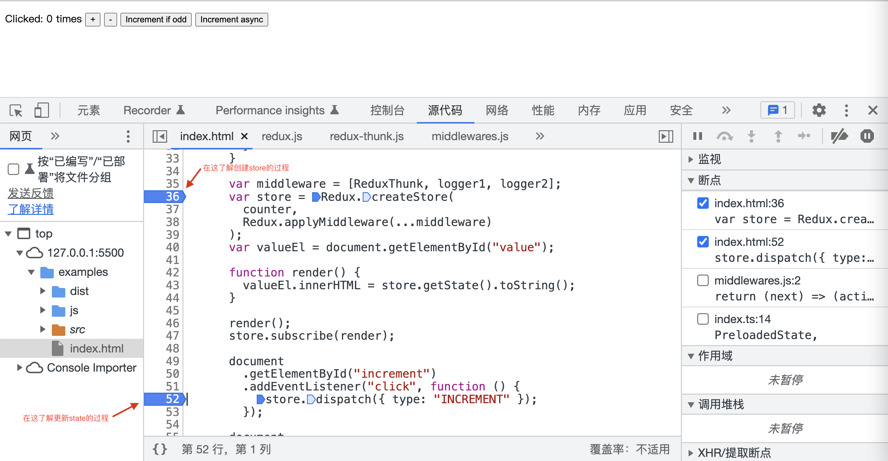
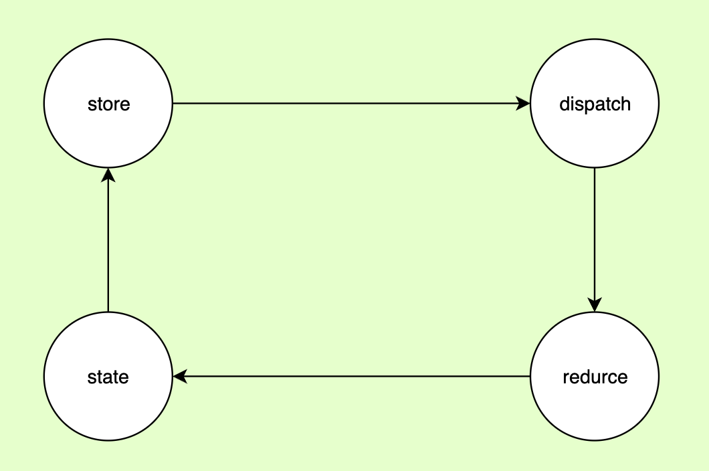
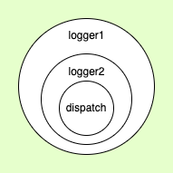

# redux

本文主要总结一些 redux 源码库中的设计思路和值得学习的工具方法，如需学习源码流程请在[仓库](https://github.com/ImDaret/redux-debugger)中自行 debugger 进行了解

## 如何 debugger 源码

- 打开 examples 目录下有 index.html

- 打开开发者工具，在下图位置进行断点
  [](https://github.com/ImDaret/redux-debugger/blob/main/imgs/debugger.png)

## 设计理念

单向数据流
[](https://github.com/ImDaret/redux-debugger/blob/main/imgs/process.png)

## 设计思路

### currentListener & nextListener 保证订阅只在下一次 dispatch 生效

订阅时`push`进 nextListeners

```ts
function subscribe(listener: () => void) {
  // ...抛错代码
  nextListeners.push(listener);
  return function unsubscribe() {
    nextListeners.splice(index, 1);
  };
}
```

dispatch 时对 currentListener 赋值，并且触发订阅

```ts
function dispatch(action: A) {
  // ....
  const listeners = (currentListeners = nextListeners); // 赋值并触发订阅
  for (let i = 0; i < listeners.length; i++) {
    const listener = listeners[i];
    listener();
  }

  return action;
}
```

### 中间件实现-洋葱模型

[](https://github.com/ImDaret/redux-debugger/blob/main/imgs/onion.png)

```ts
// 假如我现在有两个中间件，middleware = [logger1, logger2]
// 由 compose 函数可知，logger1 的 next 参数为 logger2 的返回值，logger2 的 next参数为store.dispatch，如果有更多中间件，以此类推。注意：中间件只有执行 next 方法才会向下继续执行
// 所以调用 dispatch 就相当于经历了一层层的中间件，最终调用 store.dispatch(action)
const dispatch = compose(...middleware)(store.dispatch);
```

## 工具方法

- 判断一个对象是否是普通对象

```ts
function isPlainObject(obj: any): boolean {
  if (typeof obj !== "object" || obj === null) return false;

  let proto = obj;
  while (Object.getPrototypeOf(proto) !== null) {
    proto = Object.getPrototypeOf(proto);
  }

  return Object.getPrototypeOf(obj) === proto;
}
```

- 组合多个函数

```ts
function compose(...funcs: Function[]) {
  if (funcs.length === 0) {
    // infer the argument type so it is usable in inference down the line
    return <T>(arg: T) => arg;
  }

  if (funcs.length === 1) {
    return funcs[0];
  }

  return funcs.reduce(
    (a, b) =>
      (...args: any) =>
        a(b(...args))
  );
}
```
