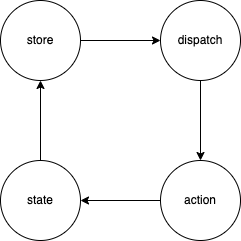

# redux-debugger

## 源码流程

单向数据流


## 工具方法

- 判断一个对象是否是普通对象

```ts
function isPlainObject(obj: any): boolean {
  if (typeof obj !== "object" || obj === null) return false;

  let proto = obj;
  while (Object.getPrototypeOf(proto) !== null) {
    proto = Object.getPrototypeOf(proto);
  }

  return Object.getPrototypeOf(obj) === proto;
}
```

- 组合多个函数

```ts
function compose(...funcs: Function[]) {
  if (funcs.length === 0) {
    // infer the argument type so it is usable in inference down the line
    return <T>(arg: T) => arg;
  }

  if (funcs.length === 1) {
    return funcs[0];
  }

  return funcs.reduce(
    (a, b) =>
      (...args: any) =>
        a(b(...args))
  );
}
```

## 设计方法

- currentListener & nextListener 保证订阅只在下一次 dispatch 生效

订阅时`push`进 nextListeners

```ts
function subscribe(listener: () => void) {
  // ...抛错代码
  let isSubscribed = true;
  ensureCanMutateNextListeners(); // 保证不是同一个引用
  nextListeners.push(listener);
  return function unsubscribe() {
    if (!isSubscribed) {
      return;
    }
    // ...抛错代码
    isSubscribed = false;
    ensureCanMutateNextListeners();
    const index = nextListeners.indexOf(listener);
    nextListeners.splice(index, 1);
    currentListeners = null;
  };
}
```

dispatch 时对 currentListener 赋值，并且触发订阅

```ts
function dispatch(action: A) {
  try {
    isDispatching = true;
    currentState = currentReducer(currentState, action); // 更新state
  } finally {
    isDispatching = false;
  }

  const listeners = (currentListeners = nextListeners); // 赋值并触发订阅
  for (let i = 0; i < listeners.length; i++) {
    const listener = listeners[i];
    listener();
  }

  return action;
}
```

- 中间件实现-洋葱模型
  

```ts
// 假如我现在有两个中间件，middleware = [logger1, logger2]
// 由 compose 函数可知，logger1 的 next 参数为 logger2 的返回值，logger2 的 next参数为store.dispatch，如果有更多中间件，以此类推。注意：中间件只有执行 next 方法才会向下继续执行
// 所以调用 dispatch 就相当于经历了一层层的中间件，最终调用 store.dispatch(action)
const dispatch = compose(...middleware)(store.dispatch);
```

自己实现一个通用的洋葱模型构造器

```ts
// middleware 建议的格式
const middleware =
  (next) =>
  (...args) => {
    // ...对args业务处理

    // 经过处理过的参数传递到下一颗洋葱
    next(...afterArgs);
    // 最终的核心洋葱会调用core(...afterArgs)
  };

export function createOnion(middlewares, core) {
  return compose(...middlewares)(core);
}
```
